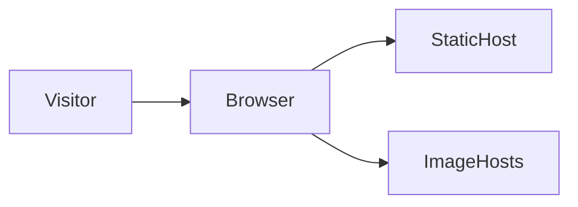
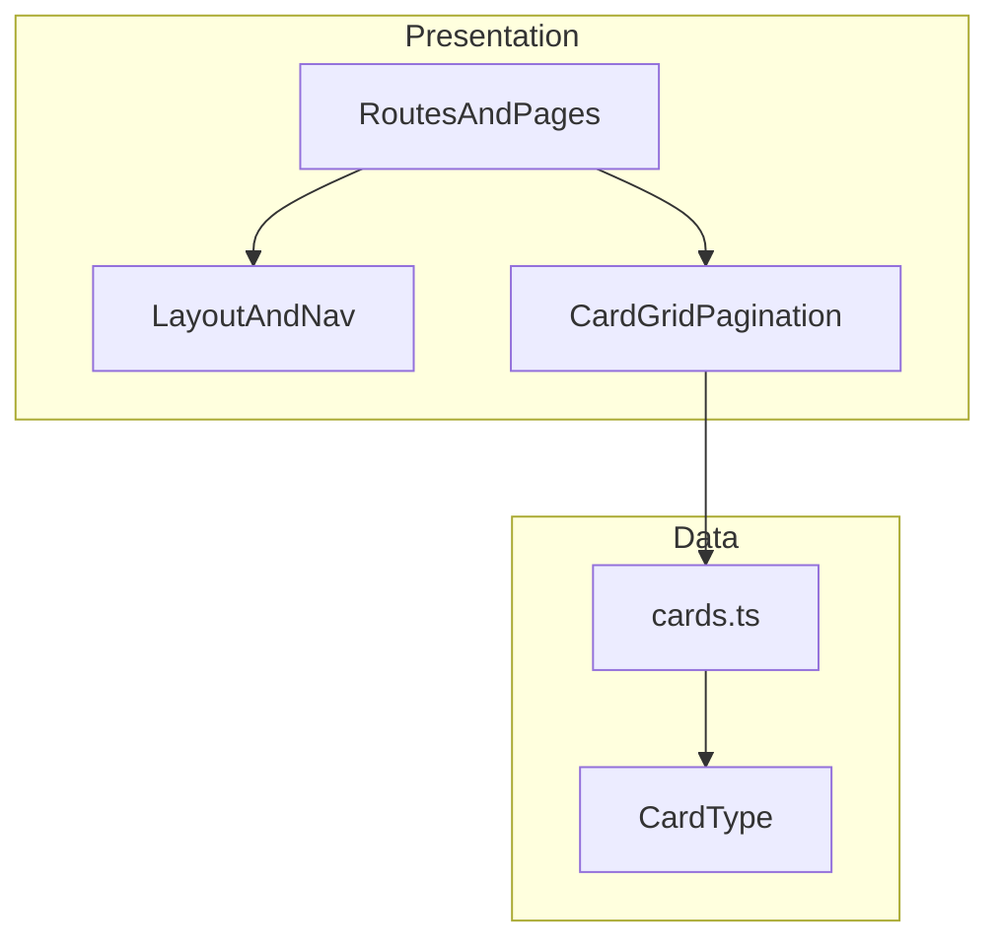
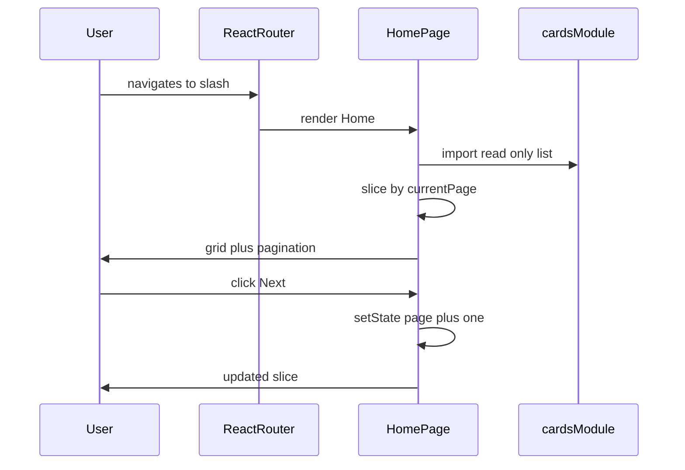
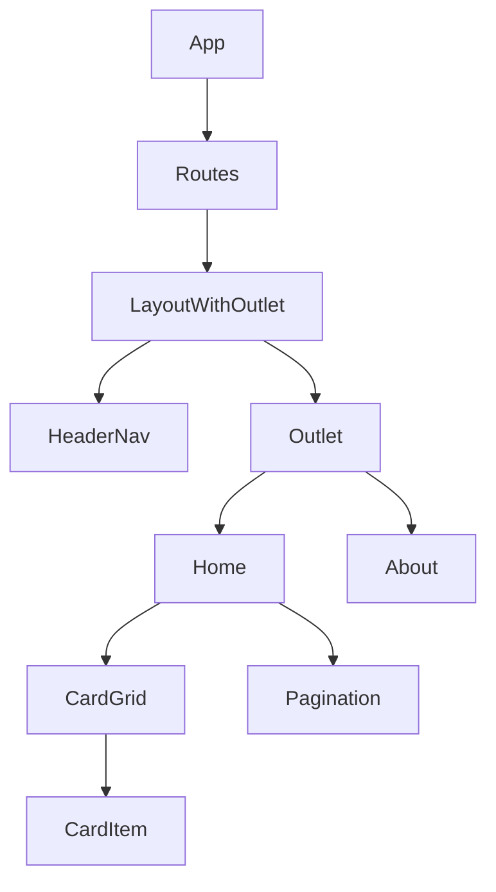
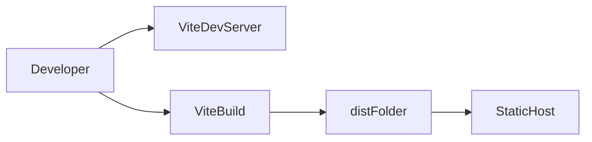
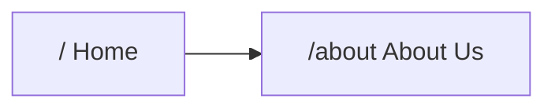

# Pokemon cards website (20 cards, 10 per page, About Us)

## Recommended stack

Use **[Vite](https://vitejs.dev/) + [React](https://react.dev/) + [TypeScript](https://www.typescriptlang.org/)** with **[React Router](https://reactrouter.com/)** for two routes (`/` and `/about`). This keeps the project small, fast to run locally, and easy to deploy as static files (Vercel, Netlify, GitHub Pages, etc.).

**Alternative:** [Next.js](https://nextjs.org/) App Router if you prefer file-based routing and built-in conventions; the same UI and data layer apply.

## Architecture

### System context

The app is a **client-rendered SPA** served as **static assets** (HTML, JS, CSS). There is **no first-party backend** in scope: the browser loads the bundle, React hydrates the UI, and card content comes from a **bundled static module** (`cards.ts`). Images are referenced by **HTTPS URLs** (browser fetches them directly from image hosts).



- **StaticHost:** output of `vite build` (e.g. Vercel/Netlify/S3 + CDN).
- **ImageHosts:** whatever origin hosts the 20 card image URLs (no app server proxy in MVP).

### Application layers

Keep dependencies pointing **downward** only: UI depends on data shapes and small presentational components; **data module has no React imports**.



| Layer | Responsibility |
|-------|----------------|
| **Routes / pages** | Map URLs to screens; own page-level state (e.g. `currentPage` on Home). |
| **Layout** | Shared chrome: header, nav links, footer, theme-aware shell. |
| **Components** | Reusable, mostly stateless UI: grid, card tile, pagination bar. |
| **Data** | Single source of truth for the 20 records; pagination **slices** this list in the page or a tiny `usePagination` hook colocated with Home. |

### Routing and runtime flow

`main.tsx` mounts `<BrowserRouter>` and `<App>`. `App` defines `<Routes>`: `/` → `Home`, `/about` → `About`. Both wrap (or nest under) `Layout` so navigation stays consistent.



Optional later enhancement: sync `currentPage` with `?page=` via `useSearchParams` so refresh and sharing preserve the page index (still no server).

### Component structure

Logical tree (not every DOM node). Prefer a **parent layout route** so the shell renders once and only the inner page swaps.



- **`LayoutWithOutlet`:** `Layout` renders shared chrome plus `<Outlet />` for nested child routes (`/` → `Home`, `about` → `About`).
- **`CardItem`** (or inline in grid) handles image `loading="lazy"` and alt text from card name.

### Pagination and state boundaries

- **State owner:** `Home` (or a `usePagination({ items, pageSize })` hook used only by `Home`).
- **Derived values:** `totalPages = ceil(items.length / pageSize)` (with 20 and 10, result is 2), `visibleCards = slice(...)`.
- **Pagination UI:** receives `page`, `totalPages`, and callbacks `onPrev` / `onNext` (or `onPageChange(n)`); remains dumb/presentational.

This keeps pagination rules **testable** in isolation (pure functions) if you extract `getPageSlice(items, page, pageSize)`.

### Styling architecture

- **Global tokens:** CSS variables on `:root` (colors, radii, spacing).
- **Component styles:** either **CSS modules** per component or a single **`index.css`** with BEM-like class names—match one approach project-wide.
- **No theme runtime switch** required for MVP; "Pokemon colors" are fixed tokens.

### Build and deployment



- **Dev:** `vite` serves source with HMR.
- **Prod:** `vite build` emits hashed assets and `index.html`; host serves `index.html` for unknown paths if you ever use client-side deep links (configure SPA fallback on the host).

### Future extensions (architecture-preserving)

- **Remote API:** introduce `src/services/tcgClient.ts` and optionally React Query; pages call hooks instead of importing `cards.ts` directly.
- **SEO-heavy About:** migrate to Next.js or add prerender plugin—out of scope for initial Vite SPA.

## Information architecture



- **Home:** hero or simple header + card grid + pagination controls (Previous / Next or page numbers).
- **About Us:** short mission copy, optional "how we built this" note, link back home.

## Data: 20 cards

- Define a **static array of 20 card records** in something like [`src/data/cards.ts`](src/data/cards.ts) (id, name, image URL, optional set/rarity text).
- **Image sources:** use publicly documented image URLs (e.g. [Pokemon TCG API](https://docs.pokemontcg.io/) card images if you want real scans, or [PokeAPI](https://pokeapi.co/) sprites if you prefer a lighter "creature" look). For a demo with zero API keys and no runtime failures, **hardcode 20 image URLs** you verify once; optional follow-up is a tiny fetch layer that loads from TCG API with graceful fallback.

## Pagination (10 per page)

- Derive **`PAGE_SIZE = 10`** and **`totalPages = 2`** from `cards.length`.
- Store **`currentPage`** in React state (URL query `?page=1` is optional but nice for shareable links; not required for MVP).
- **Slice** the array: `cards.slice((page - 1) * 10, page * 10)`.
- Disable **Previous** on page 1 and **Next** on page 2; show a small "Page X of 2" label.

## Pokemon-inspired theme

Implement with **CSS custom properties** in a global stylesheet (e.g. [`src/index.css`](src/index.css)) so components stay clean:

| Role | Suggested token | Notes |
|------|-----------------|--------|
| Primary | `#E3350D` / `#EE1515` | Pokedex / brand red |
| Accent | `#FFCB05` | Pikachu yellow (buttons, highlights) |
| Dark base | `#1D1D1F` or deep blue `#0A1628` | Background / header |
| Surface | `#2C2C2E` or card panels | Elevated panels |
| Text | off-white `#F5F5F7` on dark | Readability |

- Use a **rounded "card" panel** with subtle border and shadow for each Pokemon card.
- **Typography:** one display font (e.g. something bold/geometric from Google Fonts) for headings + system UI for body, or a single well-paired pair—keep it to two families max.
- **Accessibility:** ensure yellow-on-white is never used for small text; keep contrast **WCAG AA** for body copy (test primary button text on yellow).

## File / component layout (suggested)

| Path | Purpose |
|------|---------|
| [`index.html`](index.html), [`vite.config.ts`](vite.config.ts), [`package.json`](package.json) | Vite scaffold |
| [`src/main.tsx`](src/main.tsx), [`src/App.tsx`](src/App.tsx) | Entry + router shell |
| [`src/pages/Home.tsx`](src/pages/Home.tsx) | Grid + pagination |
| [`src/pages/About.tsx`](src/pages/About.tsx) | About Us content |
| [`src/components/CardGrid.tsx`](src/components/CardGrid.tsx) | Presentational grid |
| [`src/components/Pagination.tsx`](src/components/Pagination.tsx) | Controls |
| [`src/components/Layout.tsx`](src/components/Layout.tsx) | Header/nav/footer + `<Outlet />` for child pages |
| [`src/data/cards.ts`](src/data/cards.ts) | 20 static cards |

## Source code folder structure

Recommended layout for a Vite + React + TS SPA of this size: **feature-lean folders** (pages, components, data) with optional small splits when files grow.

```text
pokemon-shop/
├── public/                 # Static files copied as-is (favicon.ico, etc.)
├── index.html
├── package.json
├── tsconfig.json
├── tsconfig.node.json
├── vite.config.ts
└── src/
    ├── main.tsx            # createRoot + BrowserRouter
    ├── App.tsx             # Route tree (or re-export from routes.tsx)
    ├── index.css           # :root tokens, resets, global utilities
    ├── vite-env.d.ts
    ├── assets/             # Optional: local images/fonts referenced by URL import
    ├── data/
    │   ├── cards.ts        # 20 records + exported const
    │   └── types.ts        # Optional: Card type shared by UI
    ├── pages/
    │   ├── Home.tsx
    │   └── About.tsx
    ├── components/
    │   ├── layout/
    │   │   └── Layout.tsx  # Shell + <Outlet /> + footer slot if needed
    │   ├── cards/
    │   │   ├── CardGrid.tsx
    │   │   └── CardItem.tsx
    │   └── Pagination.tsx  # Or components/ui/Pagination.tsx if you add more primitives
    └── lib/                # Optional: pure helpers (e.g. getPageSlice.ts), no JSX
```

**MVP flattening:** If you prefer fewer folders at first, use `src/components/Layout.tsx`, `CardGrid.tsx`, `CardItem.tsx`, and `Pagination.tsx` directly under `components/` and skip `layout/` and `cards/` until the file count grows.

**What stays out of `src/`:** build config, lockfile, `README`, CI, and environment samples (`.env.example`) at repo root; no backend `server/` in this plan.

## Quality bar

- **Responsive grid:** 1 column on narrow screens, 2–3+ on wider (still 10 items per page; layout adapts).
- **Empty states:** not needed if data is static, but pagination logic should not break if you later add/remove cards (derive page count from length).
- **README:** one short section on `npm install` / `npm run dev` / `npm run build` (only if you want repo docs).

## Implementation order

1. `npm create vite@latest` (React + TS), add `react-router-dom`.
2. Add global theme variables + **nested routes** (parent `Layout` with `<Outlet />`, children for `/` and `/about`) and nav links.
3. Add `cards` data (20 items) and `Home` with slice + pagination.
4. Polish About page copy and visual consistency with theme.
5. Manual pass: mobile width, keyboard focus on pagination, contrast check.

## Out of scope (unless you ask later)

- User accounts, cart, checkout, or a real backend.
- Fetching all sets from live APIs without caching (adds complexity and rate limits).
