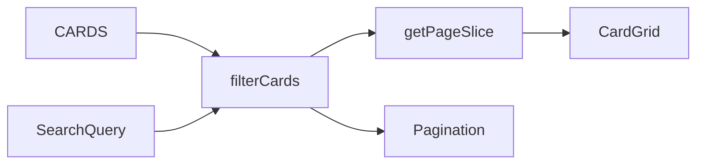

# Gallery search feature (SDLC-style plan)

## Context (current system)

- Data: static [`CARDS`](src/data/cards.ts) (20 Base Set entries), typed by [`CardSchema`](src/data/cardSchema.ts) / [`types`](src/data/types.ts).
- UI: [`Home.tsx`](src/pages/Home.tsx) composes intro + [`CardGrid`](src/components/cards/CardGrid.tsx) + [`Pagination`](src/components/Pagination.tsx).
- Pagination: [`PAGE_SIZE`](src/lib/pagination.ts), [`getPageSlice`](src/lib/pagination.ts), [`getTotalPages`](src/lib/pagination.ts). Empty lists still yield `totalPages === 1` today; the grid can be empty while the nav still reads “Page 1 of 1”—treat this as a **gap to close** for search with zero matches.

**Your UI constraint:** one search text box (plus supporting copy for accessibility and empty states—still a single primary control).

---

## 1. Requirements (BDD)

### Feature: Gallery search

**User story:** As a visitor on the gallery home page, I want a single search box so I can narrow featured cards by text on the card, without leaving the page.

**Background** (shared for scenarios below):

- **Given** I am on the gallery home page
- **And** cards are loaded from the static in-browser catalog (filtering does not call a search API)

---

**Rule: Effective query and matching**

- The **effective query** is the search text with leading and trailing whitespace removed.
- If the effective query is empty, **no filter** is applied (full catalog, same pagination idea as today).
- Otherwise a card **matches** when the effective query is a **case-insensitive substring** of `name`, or of `setName` / `rarity` **when that field is present** on the card (missing optional fields do not match).

---

**Scenario: No effective query shows the full catalog**

- **When** the search box is empty, whitespace-only, or I clear a prior search back to no effective query
- **Then** I see the full catalog with the same page size (10) and pagination as an unfiltered visit

---

**Scenario Outline: Substring hits name, set, or rarity**

- **When** I enter `<typed>`
- **Then** the grid lists exactly the cards that match the Rule for that effective query (and still paginates when there are more than 10 matches)

| typed | note |
|--------|------|
| zard | name substring |
| BASE | set substring; casing ignored |
| holo | rarity substring |

---

**Scenario: Omitted optional fields never match**

- **Given** a card omits `setName` and/or `rarity`
- **When** I search for text that would only match that omitted field
- **Then** the card is not matched via the omitted field (other present fields and `name` still apply)

---

**Scenario: Filtered pagination and reset on query change**

- **Given** more than ten cards match my current query
- **When** I view the first page
- **Then** I see at most ten cards and total pages reflect the **filtered** count, not the full catalog
- **Given** I am on page 2 (filtered or unfiltered)
- **When** I change the search text
- **Then** I land on page 1 of the newly filtered results

---

**Scenario: No matches**

- **When** I enter a query that matches no card
- **Then** I see an empty-state message
- **And** pagination does not suggest multiple pages of hits (hide or inert pattern—implementation choice locked in by tests)

---

**Scenario: Accessible search control**

- **When** I move focus to or inspect the search control
- **Then** it has an accessible name (e.g. `<label>` and/or `aria-label`)
- **And** it sits in a sensible search landmark (e.g. `role="search"` wrapper or `type="search"` with label)

---

### Out of scope (unless you later expand)

- URL query params for `?q=` (shareable search)—not requested; can be a follow-up.
- Highlighting matched substrings in titles.
- Fuzzy ranking / typo tolerance.
- Debouncing (optional; not required for 20 local rows).

---

## 2. Design (high level)

- **Single source of truth:** `query` string in `Home` (or lifted only if you split components later).
- **Derived data:** `filteredCards = useMemo(() => filter(CARDS, query), [query])`, then `totalPages = getTotalPages(filteredCards.length, PAGE_SIZE)` and `visible = getPageSlice(filteredCards, page, PAGE_SIZE)`.
- **Pure filter helper** in [`src/lib/`](src/lib/) (e.g. `filterCardsByQuery.ts`) with unit tests—keeps [`cards.ts`](src/data/cards.ts) free of React per project conventions.

---

## 3. Implementation notes (when you execute later)

- **Placement:** Search control in [`Home.tsx`](src/pages/Home.tsx) intro block (above the grid, below the lede)—matches reading order: describe gallery → narrow → browse.
- **Styling:** Extend [`src/index.css`](src/index.css) with BEM-like classes consistent with `.page-home`, `.pagination`.
- **Pagination edge case:** If `filteredCards.length === 0`, avoid misleading “Page 1 of 1” with enabled buttons; either conditional render of [`Pagination`](src/components/Pagination.tsx) or extend props to support `totalPages={0}` / `disabled`—prefer the smallest change that keeps [`Pagination.integration.test.tsx`](src/components/Pagination.integration.test.tsx) expectations valid.

---

## 4. Verification (testing)

- **Unit:** [`filterCardsByQuery` tests](src/lib/)—case, trim, multi-field match, optional fields absent.
- **Integration:** [`Home.integration.test.tsx`](src/pages/Home.integration.test.tsx)—type query, assert visible `h2` titles subset; clear query restores original page-1 behavior; query that yields zero results shows empty state and acceptable pagination behavior.
- **E2E (smoke):** [`e2e/gallery-home.spec.ts`](e2e/gallery-home.spec.ts) or new spec—open gallery, fill search, assert a known card title appears or count drops—aligned with [`.cursor/skills/e2e-tests.md`](.cursor/skills/e2e-tests.md) if you use that workflow.

---

## 5. Risks and assumptions

- **Assumption:** Substring match is acceptable for “search”; no relevance ordering required.
- **Risk:** Users may expect Pokémon-specific tokens (e.g. “holo” vs “Rare Holo”)—copy in empty state can suggest trying shorter terms; no ML needed for MVP.

---

## 6. Key files to touch (execution phase)

| Area | File |
|------|------|
| UI + state | [`src/pages/Home.tsx`](src/pages/Home.tsx) |
| Filter logic + tests | New `src/lib/filterCardsByQuery.ts` + `filterCardsByQuery.test.ts` |
| Styles | [`src/index.css`](src/index.css) |
| Regression | [`src/pages/Home.integration.test.tsx`](src/pages/Home.integration.test.tsx) |
| Smoke | [`e2e/gallery-home.spec.ts`](e2e/gallery-home.spec.ts) (or sibling spec) |

No changes required to [`cardSchema.ts`](src/data/cardSchema.ts) unless you add fields later.
