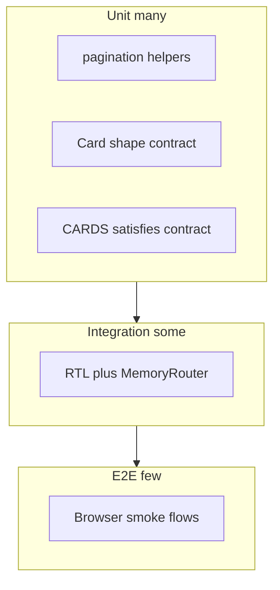
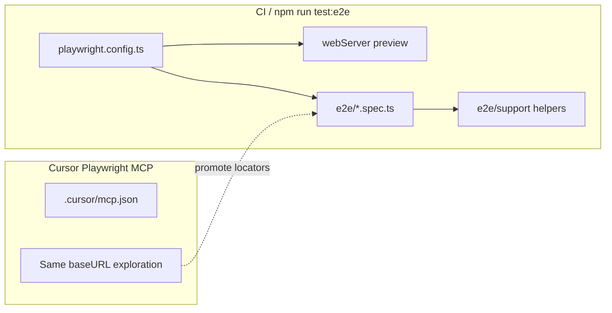

# Test plan (testing pyramid)

## Context

- **Stack:** Vite, React 19, TypeScript, React Router ([`src/App.tsx`](src/App.tsx)).
- **Critical pure logic:** [`src/lib/pagination.ts`](src/lib/pagination.ts) (`getTotalPages`, `getPageSlice`, `PAGE_SIZE`).
- **UI surfaces:** [`src/pages/Home.tsx`](src/pages/Home.tsx) (pagination state + grid), [`src/components/Pagination.tsx`](src/components/Pagination.tsx), [`src/components/layout/Layout.tsx`](src/components/layout/Layout.tsx), [`src/pages/About.tsx`](src/pages/About.tsx), [`src/components/cards/CardGrid.tsx`](src/components/cards/CardGrid.tsx) / `CardItem.tsx`.
- **Data:** static [`src/data/cards.ts`](src/data/cards.ts) (20 cards)—validate length and invariants in unit tests if you export a constant or small helper.

## Recommended toolchain

| Layer | Tooling | Rationale |
|-------|-----------|-----------|
| Unit + integration | **Vitest** + **@vitejs/plugin-react** (already present) + **jsdom** + **@testing-library/react** | Native Vite integration, fast watch mode. |
| Contract (minimal) | Same as unit (**Vitest**); optional **Zod** if you want a single schema source | No separate Pact broker or HTTP mocks in v1. |
| E2E | **Playwright** (`@playwright/test`) only | Checked-in `e2e/*.spec.ts`, `playwright.config.ts`, `webServer` for `preview` (or dev URL); CI runs `npx playwright test`. Structure tests as **Playwright-native BDD** (see Layer 3)—not Gherkin unless you opt in later. |

Add scripts in [package.json](package.json): e.g. `test`, `test:watch`, `test:e2e` (and optionally `test:e2e:ui`), plus a single canonical **`playwright install`** path tied to `@playwright/test` after it is added (avoid conflicting Playwright versions with `@playwright/mcp`).

### Playwright MCP (Cursor)

Use the **[Playwright MCP](https://github.com/microsoft/playwright-mcp)** server in Cursor for **interactive** E2E work: drive a real browser from the agent, reproduce steps, capture selectors, and debug flakiness **without** replacing the committed Playwright test suite. **BDD-style E2E scenarios, `webServer` / `baseURL`, locator strategy, and CI** for Playwright are spelled out under **Layer 3** below.

| Concern | Playwright MCP | Playwright test files (`e2e/`) |
|---------|----------------|----------------------------------|
| Purpose | Exploration, authoring aid, manual-style verification in chat | Regression suite, CI gate, repeatable assertions |
| When | Designing a new flow, validating a bug, refining locators | After behavior is understood; lock in smoke flows |
| Source of truth | Proposes steps and selectors; human reviews | `expect(...)` in version control |

**Rules:** MCP sessions do not replace CI; new stable behavior should end up as **Playwright specs** under `e2e/`. Keep MCP pointed at the same **base URL** as `playwright.config.ts` (e.g. local preview on `127.0.0.1`) so selectors match CI runs.

---

## Layer 1 — Unit tests (base, largest volume)

**Target files:** primarily [`src/lib/pagination.ts`](src/lib/pagination.ts); optionally tiny pure helpers if you extract any from `Home`.

**`getTotalPages`**

- `itemCount = 0`, positive `pageSize` → expect `1` (current `Math.max(1, ceil(0))` behavior—document as spec).
- `itemCount = 20`, `pageSize = 10` → `2`.
- `itemCount = 21`, `pageSize = 10` → `3`.
- `itemCount = 1`, `pageSize = 10` → `1`.

**`getPageSlice`**

- Twenty items, page `1`, size `10` → first ten IDs/names match first half of fixture.
- Page `2` → second ten.
- `page = 0` or negative → clamps to page `1`.
- `page` greater than total → clamps to last page.
- Empty `items` → empty slice; total pages still `1`.

**Data**

- `CARDS.length === 20`.
- Contract coverage overlaps with the section below; keep **one** canonical definition of “valid card” (helper or schema) and assert `CARDS` in a loop.

Do **not** unit-test external TCG image URLs over the network; keep tests offline.

### Contract testing (minimal, still Layer 1)

Treat the **`Card`** shape as the **consumer contract** for all UI that reads [`src/data/types.ts`](src/data/types.ts). This is **not** a bilateral HTTP pact with the Pokemon TCG API (no live provider); it is **offline shape validation** so bad edits to [`src/data/cards.ts`](src/data/cards.ts) fail CI fast.

| Field | Required? | Rule (minimal) |
|-------|-----------|----------------|
| `id` | **Mandatory** | Non-empty string |
| `name` | **Mandatory** | Non-empty string |
| `imageUrl` | **Mandatory** | Non-empty string; optionally `^https?:` if you want one extra guard |
| `setName` | **Optional** | If present, must be a string (may be empty only if you allow it—prefer non-empty when present) |
| `rarity` | **Optional** | If present, must be a string |

**Example invalid payloads (tests should reject or `safeParse` failure):**

- `{}` — missing mandatory fields.
- `{ id: 'x', name: '', imageUrl: 'https://example.com/a.png' }` — empty `name`.
- `{ id: 'x', name: 'Y', imageUrl: '' }` — empty `imageUrl`.

**Example valid payloads:**

- `{ id: 'base1-1', name: 'Alakazam', imageUrl: 'https://images.pokemontcg.io/base1/1.png' }` — no optional fields.
- Same object with `setName: 'Base Set', rarity: 'Rare Holo'` — optional fields present.

**Minimal implementation:** one pure function `assertValidCard(c: unknown): asserts c is Card` or `isCard(c): c is Card`, **or** a single **Zod** `CardSchema` with `.strict()` on unknown keys only if you want to forbid typos like `imageURL`—otherwise keep default loose object parsing. Run `CARDS.forEach(assertValidCard)` in one test.

---

## Layer 2 — Integration tests (middle, fewer)

Use **Vitest + jsdom + React Testing Library** with **`MemoryRouter`** (and optional `Routes` matching [`src/App.tsx`](src/App.tsx)) so navigation does not need a real browser.

**Layout + routing**

- Render app (or `Layout` + child routes) with initial entry `/`: nav shows Gallery as active; About link present.
- Navigate to `/about`: About heading visible; “Back to gallery” (or equivalent) link works.
- Unknown path: still covered by `<Navigate to="/" replace />` in [`src/App.tsx`](src/App.tsx)—assert redirect behavior with `initialEntries={['/nope']}`.

**Home + pagination**

- Initial load: exactly **10** card titles (or images) from first page; “Page **1** of **2**” (or accessible name) present.
- Click **Next**: shows second set of 10; status “Page 2 of 2”; **Next** disabled.
- Click **Previous**: back to page 1; **Previous** disabled on page 1.
- Keyboard / a11y: tab to pagination buttons; `aria-disabled` / `disabled` matches spec ([`src/components/Pagination.tsx`](src/components/Pagination.tsx)).

**Pagination component in isolation**

- With controlled `page` / callbacks from tests: assert disabled states and that `onPrev` / `onNext` fire when enabled.

**CardGrid / CardItem**

- Given a short mock `cards` array: correct number of list items / articles; image `alt` includes card name ([`src/components/cards/CardItem.tsx`](src/components/cards/CardItem.tsx)).

---

## Layer 3 — E2E tests (top, smallest set)

**Runner:** **`@playwright/test`** (mandatory for this project). This layer is intentionally **small** (about **3–5** smoke scenarios to start).

### Setup and config

- Start the app once per CI job via **`webServer`** in `playwright.config.ts`, e.g. `npm run build && npm run preview` with **fixed host and port** aligned to [`vite.config.ts`](vite.config.ts) (`server.host` **`127.0.0.1`**, `port` **`5173`**).
- Set Playwright **`use.baseURL`** to **`http://127.0.0.1:5173`** so `page.goto('/')` matches local dev and MCP sessions.
- Recommended `webServer` behavior: **`reuseExistingServer: !process.env.CI`** so local runs can attach to an already-running dev server; CI always starts a fresh preview.
- Optional quality knobs: `fullyParallel: true`, `retries` on CI, `use: { trace: 'on-first-retry' }`. Verify **`vite preview` CLI flags** for host/port against the repo’s Vite major version when wiring `webServer.command`.

### BDD format (Playwright-native, no Gherkin)

Use **nested `test.describe`** blocks with **Feature** / **Scenario**-style titles (readable strings), and optional thin helpers under **`e2e/support/`** named **`given*`**, **`when*`**, **`then*`** (or similar) only where they improve clarity—**not** separate `.feature` files unless you explicitly adopt Cucumber/playwright-bdd later.

**Suggested primary spec file:** `e2e/poke-cards.smoke.spec.ts` containing all smoke scenarios so the suite stays thin; split into multiple `*.spec.ts` files only if the E2E layer grows.

### Playwright MCP vs checked-in E2E (reminder)

Project MCP config: [`.cursor/mcp.json`](../.cursor/mcp.json); onboarding notes: [`.cursor/README.md`](../.cursor/README.md). Keep the **same `baseURL`** as `playwright.config.ts` when exploring in MCP so locators match CI. The comparison table (**MCP vs `e2e/`**) lives under **Recommended toolchain** above.

### Recommended scenarios (BDD titles → behavior)

Map each scenario to a nested **`test.describe('Feature: …')`** + **`test('Scenario: …')`** (or equivalent naming).

| # | Feature / scenario (title) | Behavior to assert |
|---|----------------------------|-------------------|
| 1 | **Feature:** Gallery home — **Scenario:** visitor sees the featured gallery | Open `/`; expect main heading **“Featured cards”**; expect at least one **card** in the grid (e.g. `article` or image with accessible name tied to a card). Do **not** depend on CDN image bytes or pixel-perfect rendering. |
| 2 | **Feature:** Pagination — **Scenario:** visitor moves between pages and controls disable correctly | Assert **“Page 1 of 2”** (or pagination `navigation` **“Card pages”**); click **Next**; expect second page content (e.g. first card on page 2 is **Nidoking** per [`src/data/cards.ts`](src/data/cards.ts)); **Next** disabled on last page; **Previous** returns to page 1; **Previous** disabled on page 1. |
| 3 | **Feature:** About — **Scenario:** visitor opens About from the header and returns to the gallery | Click header **“About us”**; expect **“About us”** heading; click **“← Back to the gallery”**; expect **“Featured cards”** again. |
| 4 | **Feature:** About — **Scenario:** deep link and browser history *(optional)* | `page.goto('/about')`; expect About; `page.goBack()`; expect gallery home. Use to reach the **up to 5** smoke cap only if worth the maintenance. |

**Locator strategy:** Prefer **roles and accessible names** consistent with integration tests ([`src/App.integration.test.tsx`](../src/App.integration.test.tsx), [`src/pages/Home.integration.test.tsx`](../src/pages/Home.integration.test.tsx)) and [`src/components/Pagination.tsx`](../src/components/Pagination.tsx) (`aria-label` on pagination). Assert **DOM structure and navigation**, not third-party CDN reliability.

### Dependencies and scripts

- Add **`@playwright/test`** as a devDependency; add **`test:e2e`** and optionally **`test:e2e:ui`** to [package.json](../package.json).
- **Browser install:** Prefer **`npx playwright install`** (or `playwright install chromium`) from the **`@playwright/test`**-aligned CLI once that package is present, and document one canonical install path. [`@playwright/mcp`](../package.json) may bring its own `playwright` version—**align or document** so local MCP + CI E2E do not fight over mismatched browsers.

---

## Non-functional / quality gates

- Run **unit + integration** on every PR (`npm test` in CI).
- Run **E2E** on main or nightly if cost is a concern; otherwise **on PR with browser cache** once the suite is stable (recommended default: PR gate after a few green runs).
- Optional **GitHub Actions** job: `npm ci` → `npx playwright install chromium` → `npm run test:e2e` (and reuse Playwright browser cache between runs).
- Keep **ESLint** ([`npm run lint`](package.json)) in CI; optionally add **`typescript-eslint` test file patterns** when tests live under `src/**/*.test.ts(x)` or `tests/**`.
- Document **`npm run test:e2e`**, **`playwright install`**, and **MCP vs CI** briefly in [README.md](../README.md) once E2E lands.

---

## File layout (suggested)

| Path | Purpose |
|------|---------|
| `vitest.config.ts` | Vitest + jsdom + alias match Vite |
| `src/lib/pagination.test.ts` | Unit tests |
| `src/data/cardContract.test.ts` (or `src/lib/validateCard.test.ts`) | Contract / shape tests + `CARDS` sweep |
| `src/data/validateCard.ts` or `cardSchema.ts` (optional) | Single place for mandatory vs optional rules |
| `src/pages/Home.integration.test.tsx` (or `*.test.tsx`) | Integration (example naming in repo) |
| `src/App.integration.test.tsx`, `src/test/renderWithApp.tsx` | Route integration helpers |
| `e2e/poke-cards.smoke.spec.ts` | Playwright smoke specs (BDD-style `test.describe`) |
| `e2e/support/bdd.ts` | Optional `given*` / `when*` / `then*` helpers |
| `e2e/*.spec.ts` | Additional Playwright specs if the suite grows |
| `playwright.config.ts` | Browsers, `baseURL`, `webServer` |
| `.cursor/mcp.json` | Playwright MCP server entry for Cursor (interactive only) |

---

## Out of scope (initial pyramid)

- Visual regression / Percy unless you explicitly want it.
- Load testing the static site.
- **Consumer–provider HTTP contract** testing (e.g. Pact) against `images.pokemontcg.io` or the TCG REST API—adds brokers, flakiness, and little value while [`src/data/cards.ts`](src/data/cards.ts) remains static. Revisit only if the app gains a real API client with stable OpenAPI/Pact fixtures.

